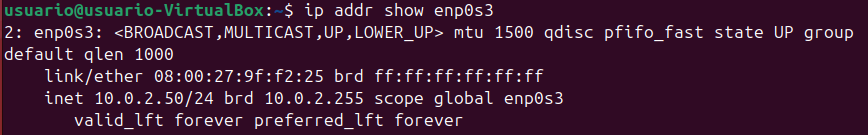
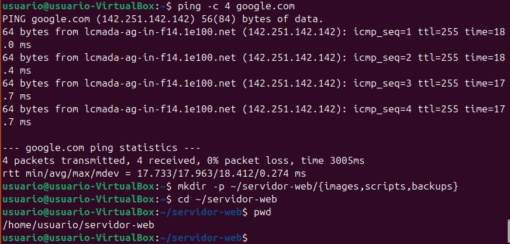
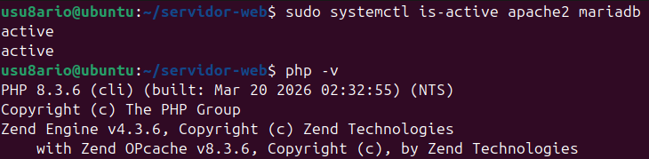
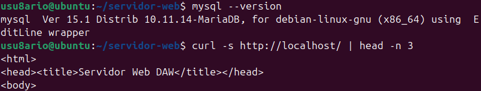
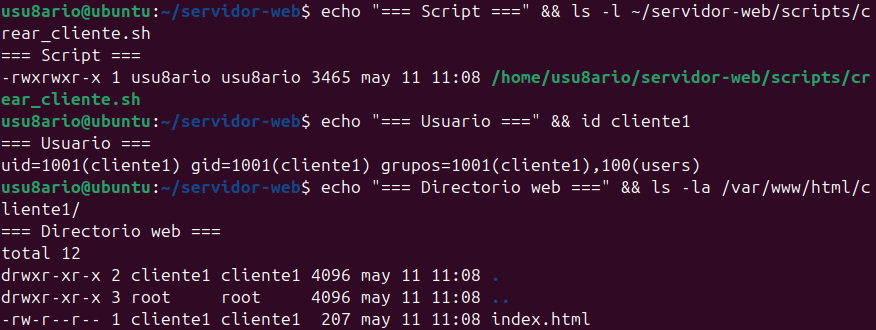
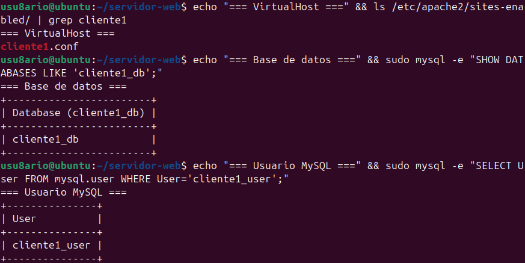
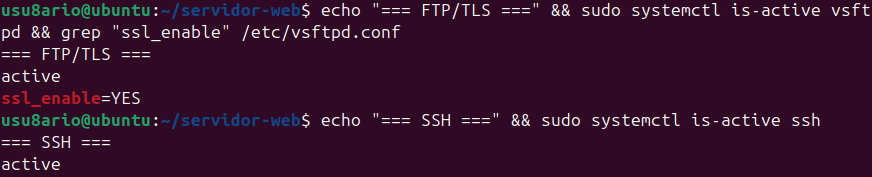
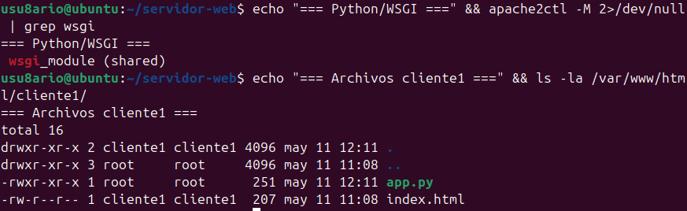
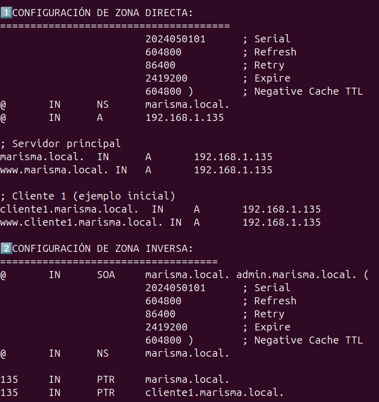
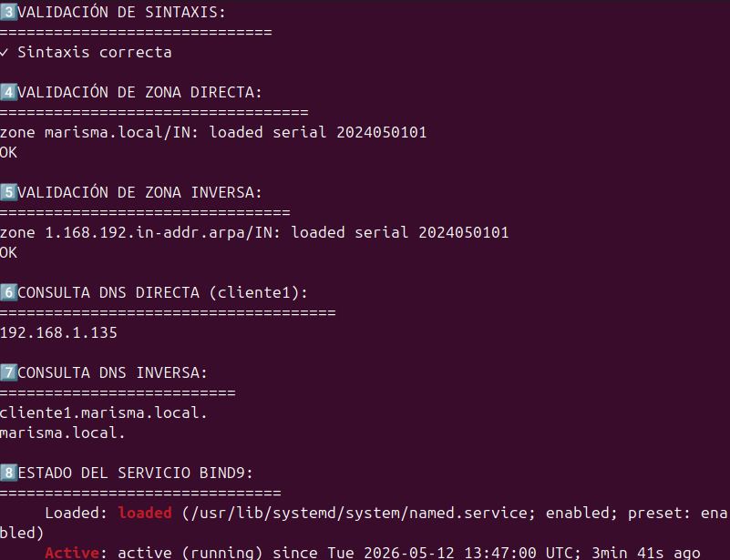

# Infraestructura de Servidor Web y Servicios de Red

Práctica del 2º trimestre — Despliegue de Aplicaciones Web (DAW 2025/26)

**Víctor Medel Martín**

> Trabajo realizado en pareja con David Garrido Suárez. Cada uno mantiene
> su propia documentación en su repositorio.

---

## De qué va esta práctica

El objetivo era montar, desde una máquina limpia, un servidor capaz de dar
alojamiento web a varios clientes a la vez: cada cliente con su espacio, su
subdominio, su base de datos y sus accesos remotos. Y que dar de alta a un
cliente nuevo no fuera un proceso manual de veinte pasos, sino un único script.

Lo monté sobre **Ubuntu Desktop 24.04 LTS** en VirtualBox, con la red en modo
puente para que la VM tuviera IP propia en la red local.

| Dato | Valor |
|---|---|
| Sistema | Ubuntu Desktop 24.04 LTS |
| Virtualización | VirtualBox (adaptador puente) |
| IP del servidor | 192.168.1.135 |
| Dominio local | `marisma.local` |
| Carpeta de trabajo | `~/infraestructura-web/` |

---

## Cómo está organizado este documento

He preferido contar la práctica por **fases de trabajo** en lugar de por
servicios sueltos, porque así se entiende el orden real en que fui montando
las cosas:

1. Preparar la base (sistema + LAMP)
2. Servicios de red (DNS, FTP, SSH, Python)
3. Automatización (el script que lo une todo)
4. Pruebas y uso real

Al final dejo una sección con los **problemas que me fui encontrando**, porque
creo que es lo más útil para quien repita la práctica.

---

## Fase 1 — La base: sistema y stack LAMP

Lo primero, dejar el sistema al día y crear la estructura de carpetas del
proyecto:

```bash
sudo apt update && sudo apt upgrade -y
sudo apt install -y net-tools curl wget vim git unzip
mkdir -p ~/infraestructura-web/{scripts,images,backups}
cd ~/infraestructura-web
```

Con la base lista, instalé el stack completo de una sola tacada — Apache,
MariaDB, PHP con sus módulos y phpMyAdmin:

```bash
sudo apt install -y apache2 mariadb-server mariadb-client \
php php-cli php-mysql php-curl php-gd php-xml php-mbstring php-zip \
libapache2-mod-php phpmyadmin
```

Después tocó dejar los servicios arrancando solos al encender la máquina y
activar los módulos de Apache que iba a necesitar más adelante (`rewrite`
para las URLs y `ssl`):

```bash
sudo systemctl enable apache2 mariadb
sudo systemctl start apache2 mariadb
sudo a2enmod rewrite ssl
sudo systemctl restart apache2
```

Para que phpMyAdmin fuera accesible desde el navegador enlacé su configuración
dentro de Apache:

```bash
sudo ln -s /etc/phpmyadmin/apache.conf /etc/apache2/conf-available/phpmyadmin.conf
sudo a2enconf phpmyadmin
sudo systemctl reload apache2
```

Al terminar esta fase ya tenía Apache respondiendo en el puerto 80, PHP 8.3
funcionando y phpMyAdmin entrando por el navegador.




---

## Fase 2 — Servicios de red

### DNS con BIND9

Esta fue la parte que más cuidado me llevó. Monté un servidor DNS autoritativo
local para resolver los subdominios de cada cliente, con resolución directa e
inversa.

```bash
sudo apt install -y bind9 bind9-utils bind9-doc dnsutils
```

Las zonas las definí en `/etc/bind/named.conf.local`:

- Zona directa: `marisma.local`
- Zona inversa: `1.168.192.in-addr.arpa`

Antes de dar nada por bueno, validé la configuración y la zona. Esto me ahorró
más de un susto:

```bash
sudo named-checkconf
sudo named-checkzone marisma.local /etc/bind/db.marisma.local
```




### FTP seguro, SSH y soporte para Python

Para la administración remota de archivos instalé vsftpd (FTP), OpenSSH (SSH y
SFTP) y el módulo WSGI para poder ejecutar aplicaciones Python desde Apache:

```bash
sudo apt install -y vsftpd openssh-server libapache2-mod-wsgi-py3
```

El FTP lo configuré en `/etc/vsftpd.conf` con dos opciones clave: cifrado TLS
y aislamiento de cada usuario en su propia carpeta (`chroot`):

```
ssl_enable=YES
chroot_local_user=YES
```

Y abrí en el firewall los puertos necesarios (FTP, SSH y el rango de puertos
pasivos de FTP):

```bash
sudo ufw allow 21/tcp
sudo ufw allow 22/tcp
sudo ufw allow 40000:40100/tcp
```

Por último activé el módulo WSGI para Python:

```bash
sudo a2enmod wsgi
sudo systemctl reload apache2
```




---

## Fase 3 — Automatización: el script `crear_cliente.sh`

Esta es la pieza central de la práctica. Todo lo de las fases anteriores no
sirve de mucho si dar de alta un cliente es un proceso manual. Así que lo
encerré todo en un único script que, con solo el nombre y la IP, deja un
cliente completamente operativo:

```bash
sudo ./crear_cliente.sh cliente1 192.168.1.135
```

Lo que hace el script por debajo, paso a paso:

- Crea el usuario del sistema en Linux
- Le genera su directorio web personal con una página inicial
- Escribe el VirtualHost de Apache y lo activa
- Inserta el registro correspondiente en la zona DNS
- Crea una base de datos para el cliente y un usuario MySQL con permisos
- Genera una contraseña aleatoria segura para ese usuario

El script vive en `~/infraestructura-web/scripts/crear_cliente.sh`.




---

## Fase 4 — Comprobación y uso real

Antes de dar la práctica por terminada, repasé que todos los servicios
estuvieran levantados:

```bash
sudo systemctl status apache2 mariadb named vsftpd ssh
```

Y fui probando cada cosa por separado:

```bash
curl http://192.168.1.135                          # Apache responde
sudo mysql -e "SHOW DATABASES;"                     # MariaDB y las BD
dig @192.168.1.135 cliente1.marisma.local +short    # resolución DNS directa
dig @192.168.1.135 -x 192.168.1.135                 # resolución DNS inversa
ssh cliente1@192.168.1.135                          # acceso remoto
```

Una vez montado, usar el servidor es inmediato. Para un cliente nuevo:

```bash
sudo ~/infraestructura-web/scripts/crear_cliente.sh empresa 192.168.1.135
```

Y ese cliente queda accesible en:

- Web: `http://empresa.marisma.local`
- phpMyAdmin: `http://192.168.1.135/phpmyadmin`
- SSH: `ssh empresa@192.168.1.135`
- SFTP: `sftp empresa@192.168.1.135`




---

## Incidencias que me encontré

Dejo aquí las cosas que no salieron a la primera, por si le sirven a alguien:

- **BIND9 no arrancaba** tras editar las zonas. La causa casi siempre era un
  punto y coma o un punto final que faltaba en el fichero de zona.
  `named-checkzone` te dice exactamente la línea del fallo: conviene pasarlo
  *siempre* antes de reiniciar el servicio.
- **El FTP con TLS daba error de conexión pasiva** hasta que abrí el rango de
  puertos `40000:40100` en el firewall. Sin ese rango, la conexión se queda
  colgada después del login.
- **phpMyAdmin daba 404** al principio: me faltaba ejecutar `a2enconf` después
  de crear el enlace simbólico.

---

## Arquitectura final

| Servicio | Tecnología | Puerto |
|---|---|---|
| Servidor web | Apache2 | 80 / 443 |
| Lenguaje dinámico | PHP 8.3 | — |
| Base de datos | MariaDB | 3306 |
| DNS | BIND9 | 53 |
| FTP seguro | vsftpd | 21 |
| Acceso remoto | OpenSSH | 22 |
| Aplicaciones Python | mod_wsgi | (sobre Apache) |

**Medidas de seguridad aplicadas:** FTP cifrado con TLS, usuarios aislados con
chroot, contraseñas aleatorias por cliente, bases de datos separadas por
cliente, validación automática de las zonas DNS y permisos restringidos en los
directorios web.
